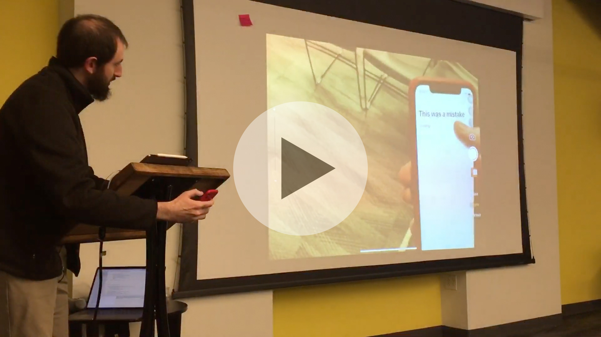

# Unnatural Scrolling

When Apple added the “Natural Scrolling” option in Mac OS X 10.7 Lion in 2011, it was controversial. People were divided, and they remain so, on whether it is better, and whether it is even right to call it “natural.” The main argument in favor is that it mimics how you scroll on a phone, moving your finger in the same direction as the content.

For [The Boston Stupid Shit No One Needs &amp; Terrible Ideas Hackathon](https://bostonstupidhackathon.com) in 2019, I decided to investigate this question by building something no one asked for: a demonstration of what it would feel like to have the “unnatural scrolling” option on your phone. I encourage you to install it on your own physical device and play with it to understand just how bad it is. But you can also watch the video, below:

